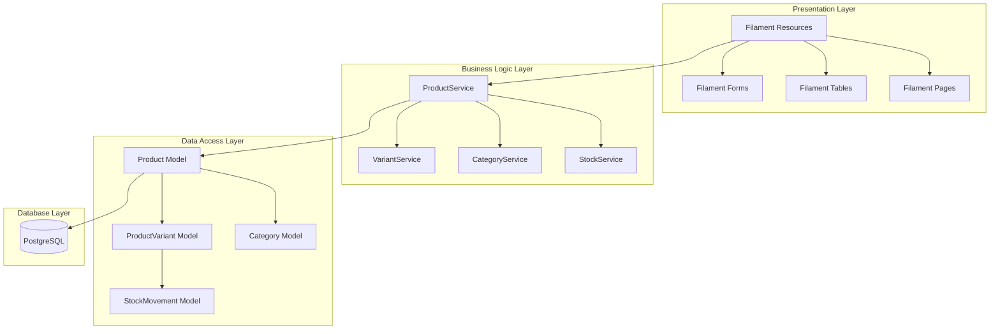
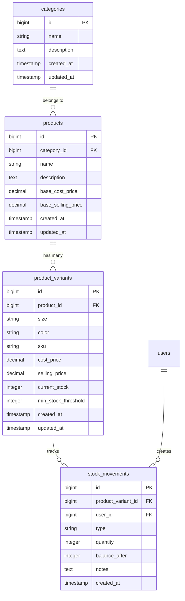

# Design Document: Product Management

## Overview

The Product Management feature serves as the foundation for a Laravel 11-based Point of Sales (POS) system designed for clothing retailers (UMKM). This feature implements a comprehensive product catalog system that handles clothing items with multiple variants (size and color combinations), organized by categories, with robust pricing and inventory tracking capabilities.

The system leverages Laravel 11's Eloquent ORM for data management and Filament as the primary admin interface, providing an intuitive and efficient user experience for business owners and staff. The architecture follows Laravel best practices with clear separation of concerns between UI (Filament Resources), business logic (Services), and data access (Models).

Key design principles include:
- **Simplicity for UMKM users**: Clean, intuitive interfaces that don't overwhelm small business operators
- **Scalability**: Database structure that can handle growing inventories and future feature expansion
- **Data integrity**: Robust validation and referential integrity to prevent data corruption
- **Performance**: Efficient queries and caching strategies for responsive user experience
- **Role-based access**: Clear separation between Owner and Cashier capabilities

## Architecture

### System Architecture

The product management system follows a layered architecture pattern within the Laravel framework:



### Database Architecture

The database design follows a normalized approach optimized for clothing retail operations:



### Technology Stack Integration

- **Laravel 11**: Core framework providing routing, middleware, and application structure
- **Filament**: Admin panel framework for rapid CRUD interface development
- **PostgreSQL**: Primary database with strong ACID compliance and JSON support
- **Eloquent ORM**: Database abstraction with relationships and query optimization
- **Livewire**: Real-time UI updates within Filament components
- **Spatie Laravel Permission**: Role and permission management for Owner/Cashier access control

## Components and Interfaces

### Core Models

#### Product Model
```php
class Product extends Model
{
    protected $fillable = [
        'category_id', 'name', 'description', 
        'base_cost_price', 'base_selling_price'
    ];
    
    protected $casts = [
        'base_cost_price' => 'decimal:2',
        'base_selling_price' => 'decimal:2',
    ];
    
    public function category(): BelongsTo
    public function variants(): HasMany
    public function getTotalStockAttribute(): int
    public function getAverageProfitMarginAttribute(): float
}
```

#### ProductVariant Model
```php
class ProductVariant extends Model
{
    protected $fillable = [
        'product_id', 'size', 'color', 'sku',
        'cost_price', 'selling_price', 'current_stock', 'min_stock_threshold'
    ];
    
    protected $casts = [
        'cost_price' => 'decimal:2',
        'selling_price' => 'decimal:2',
    ];
    
    public function product(): BelongsTo
    public function stockMovements(): HasMany
    public function isLowStock(): bool
    public function isOutOfStock(): bool
    public function getProfitMarginAttribute(): float
}
```

#### Category Model
```php
class Category extends Model
{
    protected $fillable = ['name', 'description'];
    
    public function products(): HasMany
    public function getProductCountAttribute(): int
    public function getTotalStockValueAttribute(): float
}
```

### Service Layer

#### ProductService
```php
class ProductService
{
    public function createProduct(array $data): Product
    public function updateProduct(Product $product, array $data): Product
    public function deleteProduct(Product $product): bool
    public function duplicateProduct(Product $product): Product
    public function getProductsWithLowStock(): Collection
    public function calculateTotalInventoryValue(): float
}
```

#### VariantService
```php
class VariantService
{
    public function createVariant(Product $product, array $data): ProductVariant
    public function updateVariant(ProductVariant $variant, array $data): ProductVariant
    public function adjustStock(ProductVariant $variant, int $quantity, string $reason): void
    public function generateSKU(Product $product, string $size, string $color): string
    public function bulkUpdatePrices(Collection $variants, array $priceData): void
}
```

### Filament Resources

#### ProductResource
- **Table**: Displays products with category, total variants, total stock, and actions
- **Form**: Product creation/editing with category selection and base pricing
- **Relations**: Embedded variant management with inline creation/editing
- **Filters**: Category filter, stock status filter, price range filter
- **Actions**: Bulk operations, duplicate product, export data

#### ProductVariantResource
- **Table**: Displays variants with product info, size/color, pricing, and stock levels
- **Form**: Variant creation/editing with automatic SKU generation
- **Filters**: Size filter, color filter, stock status filter, product filter
- **Actions**: Stock adjustment, bulk price updates, low stock alerts

#### CategoryResource
- **Table**: Displays categories with product count and total stock value
- **Form**: Simple category creation/editing with name and description
- **Actions**: Bulk category assignment, category merging

## Data Models

### Database Schema

#### Categories Table
```sql
CREATE TABLE categories (
    id BIGSERIAL PRIMARY KEY,
    name VARCHAR(255) NOT NULL UNIQUE,
    description TEXT,
    created_at TIMESTAMP,
    updated_at TIMESTAMP
);
```

#### Products Table
```sql
CREATE TABLE products (
    id BIGSERIAL PRIMARY KEY,
    category_id BIGINT REFERENCES categories(id) ON DELETE RESTRICT,
    name VARCHAR(255) NOT NULL,
    description TEXT,
    base_cost_price DECIMAL(10,2) NOT NULL DEFAULT 0,
    base_selling_price DECIMAL(10,2) NOT NULL DEFAULT 0,
    created_at TIMESTAMP,
    updated_at TIMESTAMP,
    
    UNIQUE(category_id, name)
);
```

#### Product Variants Table
```sql
CREATE TABLE product_variants (
    id BIGSERIAL PRIMARY KEY,
    product_id BIGINT REFERENCES products(id) ON DELETE CASCADE,
    size VARCHAR(50) NOT NULL,
    color VARCHAR(50) NOT NULL,
    sku VARCHAR(100) NOT NULL UNIQUE,
    cost_price DECIMAL(10,2) NOT NULL,
    selling_price DECIMAL(10,2) NOT NULL,
    current_stock INTEGER NOT NULL DEFAULT 0,
    min_stock_threshold INTEGER NOT NULL DEFAULT 5,
    created_at TIMESTAMP,
    updated_at TIMESTAMP,
    
    UNIQUE(product_id, size, color)
);
```

#### Stock Movements Table
```sql
CREATE TABLE stock_movements (
    id BIGSERIAL PRIMARY KEY,
    product_variant_id BIGINT REFERENCES product_variants(id) ON DELETE CASCADE,
    user_id BIGINT REFERENCES users(id) ON DELETE RESTRICT,
    type VARCHAR(50) NOT NULL, -- 'initial', 'adjustment', 'sale', 'return'
    quantity INTEGER NOT NULL,
    balance_after INTEGER NOT NULL,
    notes TEXT,
    created_at TIMESTAMP
);
```

### Data Relationships

- **Category → Products**: One-to-Many (a category can have multiple products)
- **Product → ProductVariants**: One-to-Many (a product can have multiple size/color combinations)
- **ProductVariant → StockMovements**: One-to-Many (track all stock changes for audit trail)
- **User → StockMovements**: One-to-Many (track who made stock changes)

### Data Validation Rules

#### Product Validation
- Name: Required, max 255 characters, unique within category
- Category: Required, must exist in categories table
- Base prices: Required, numeric, minimum 0, maximum 999999.99

#### ProductVariant Validation
- Size: Required, max 50 characters
- Color: Required, max 50 characters
- SKU: Required, unique across all variants, auto-generated if not provided
- Prices: Required, numeric, selling price should be >= cost price (with warning override)
- Stock: Integer, minimum 0
- Unique combination of product_id + size + color

#### Category Validation
- Name: Required, max 255 characters, unique
- Description: Optional, max 1000 characters

## Correctness Properties

*A property is a characteristic or behavior that should hold true across all valid executions of a system—essentially, a formal statement about what the system should do. Properties serve as the bridge between human-readable specifications and machine-verifiable correctness guarantees.*

Based on the prework analysis of acceptance criteria, the following properties ensure the product management system behaves correctly across all valid inputs and scenarios:

### Property 1: Product Data Persistence
*For any* valid product data (name, description, category, pricing), creating a product should result in all provided data being accurately stored and retrievable from the database with correct data types and precision.
**Validates: Requirements 1.1, 2.1, 3.1**

### Property 2: Data Update Integrity
*For any* existing product, variant, or category, updating its information should preserve all related data relationships and audit trails while accurately storing the new information.
**Validates: Requirements 1.2, 2.2, 3.2**

### Property 3: Referential Integrity Protection
*For any* product, variant, or category with dependent relationships (variants with stock, products with transactions, categories with products), deletion attempts should be prevented and appropriate error messages displayed.
**Validates: Requirements 1.3, 2.3, 3.3**

### Property 4: Field Validation Enforcement
*For any* data input operation, all required fields must be validated and invalid data formats must be rejected with clear error messages before any database operations occur.
**Validates: Requirements 1.4, 2.4, 3.4, 7.1, 7.3**

### Property 5: Uniqueness Constraint Enforcement
*For any* attempt to create duplicate product names within the same category or duplicate category names, the system should prevent creation and display appropriate error messages.
**Validates: Requirements 7.2**

### Property 6: Stock Level Management
*For any* product variant, stock level changes should be accurately tracked with proper audit trails, and stock status (in-stock, low-stock, out-of-stock) should be correctly calculated based on current levels and thresholds.
**Validates: Requirements 4.1, 4.2, 4.3, 4.5**

### Property 7: Price Calculation Accuracy
*For any* product variant with cost and selling prices, profit margin calculations should be mathematically correct, and price history should be maintained for all price changes.
**Validates: Requirements 5.1, 5.2, 5.3**

### Property 8: Business Rule Validation
*For any* attempt to set selling prices below cost prices, the system should validate the business rule and require explicit confirmation before allowing the operation.
**Validates: Requirements 5.4**

### Property 9: Role-Based Access Control
*For any* user with Owner role, all product management features should be accessible, while users with Cashier role should have read-only access with modification attempts properly denied.
**Validates: Requirements 6.1, 6.2, 6.3, 6.5**

### Property 10: Audit Trail Completeness
*For any* product management action (create, update, delete, stock change), the system should create complete audit logs with user identification, timestamps, and action details.
**Validates: Requirements 6.4**

### Property 11: Search and Filter Accuracy
*For any* search query or filter criteria, the system should return only products that match the specified criteria across product names, descriptions, and category names, with proper highlighting of matching terms.
**Validates: Requirements 8.1, 8.2, 8.3, 8.4**

### Property 12: Bulk Operation Consistency
*For any* bulk operation (category assignment, price updates, stock updates), all selected items should be processed consistently with accurate calculations and complete audit trails maintained.
**Validates: Requirements 9.1, 9.2, 9.3, 9.5**

### Property 13: Data Export Completeness
*For any* export operation, the generated files should contain all product and variant information in the specified format with proper data relationships preserved.
**Validates: Requirements 10.1**

### Property 14: Data Import Validation and Processing
*For any* import operation, the system should validate file format and data integrity, handle conflicts appropriately, maintain relationships, and provide detailed operation logs.
**Validates: Requirements 10.2, 10.3, 10.4, 10.5**

### Property 15: Display Data Accuracy
*For any* product management interface view, all displayed information (product details, variant information, category counts, stock levels, pricing) should accurately reflect the current database state.
**Validates: Requirements 1.5, 2.5, 3.5, 4.4, 5.5**

## Error Handling

### Validation Errors
- **Field Validation**: Clear, specific error messages for each validation failure
- **Business Rule Violations**: Contextual warnings with override options where appropriate
- **Uniqueness Constraints**: Specific identification of conflicting records

### System Errors
- **Database Connection Issues**: Graceful degradation with retry mechanisms
- **File Operation Errors**: Clear error reporting for import/export failures
- **Permission Errors**: Appropriate access denied messages with guidance

### User Experience
- **Form Validation**: Real-time validation feedback with field-level error display
- **Bulk Operation Errors**: Detailed success/failure reporting with partial completion handling
- **Search Errors**: Helpful suggestions when no results found

### Error Recovery
- **Transaction Rollback**: Automatic rollback on multi-step operation failures
- **Data Integrity**: Prevention of partial updates that could corrupt data relationships
- **Audit Logging**: All errors logged with sufficient context for debugging

## Testing Strategy

### Dual Testing Approach

The product management feature requires both unit testing and property-based testing to ensure comprehensive coverage:

**Unit Tests** focus on:
- Specific examples of product creation, updating, and deletion
- Edge cases like boundary values for prices and stock quantities
- Integration points between Filament resources and service classes
- Error conditions and exception handling
- Role-based access control scenarios

**Property-Based Tests** focus on:
- Universal properties that hold for all valid inputs
- Comprehensive input coverage through randomization
- Data integrity across all CRUD operations
- Business rule enforcement across all scenarios

### Property-Based Testing Configuration

- **Testing Library**: [Pest](https://pestphp.com/) with [Pest Property Testing Plugin](https://github.com/pestphp/pest-plugin-property-testing) for PHP
- **Minimum Iterations**: 100 iterations per property test to ensure thorough coverage
- **Test Tagging**: Each property test tagged with format: **Feature: product-management, Property {number}: {property_text}**

### Test Categories

#### Model Tests (`tests/Unit/Models/`)
- Product model relationships and calculated attributes
- ProductVariant model business logic and stock calculations
- Category model aggregation methods
- Data validation and casting behavior

#### Service Tests (`tests/Unit/Services/`)
- ProductService business logic and data manipulation
- VariantService stock management and SKU generation
- CategoryService operations and integrity checks
- Error handling and edge case management

#### Feature Tests (`tests/Feature/ProductManagement/`)
- End-to-end product management workflows
- Filament resource integration testing
- Role-based access control verification
- Import/export functionality testing

#### Property Tests (`tests/Property/ProductManagement/`)
- Each correctness property implemented as a separate property-based test
- Random data generation for comprehensive input coverage
- Invariant checking across all operations
- Round-trip testing for data persistence and retrieval

### Test Data Management

- **Factories**: Laravel model factories for generating realistic test data
- **Seeders**: Consistent test data sets for integration testing
- **Database Transactions**: Automatic rollback for test isolation
- **File Fixtures**: Sample import/export files for testing data transfer operations